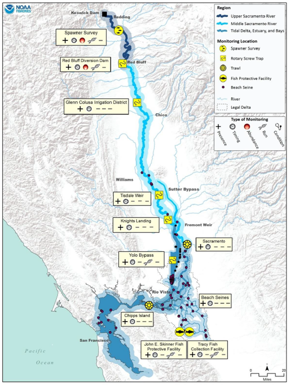

--- 
title: "Brood Year 2021 Winter-Run Chinook Salmon Report"
author: "Catarina Pien (Bureau of Reclamation)"
date: "`r Sys.Date()`"
site: bookdown::bookdown_site
documentclass: book
bibliography: [book.bib, packages.bib]
url: https://bdo-science.github.io/wr-cohort-report/
# cover-image: path to the social sharing image like images/cover.jpg
description: |
  Winter Run Chinook Salmon Cohort Report for 2021.
link-citations: yes
github-repo: rstudio/bookdown-demo
always_allow_html: true
---

# About

We summarize environmental and habitat conditions in 2021 and assess the 2021 brood year of Sacramento winter-run Chinook salmon (WRCS; _Oncorhynchus tshawytscha_) (**BY 2021**). We used data available online to generate this report. This report follows the format of the BY 2019 WRCS Report written by Anchor QEA (\@ref(https://www.anchorqea.com/news/brood-year-2019-winter-run-chinook-salmon-operations-and-monitoring-assessment/)). The assessment was in collaboration with the `Sacramento River Science Partnership`.

## WR Chinook Salmon Life History

Sacramento River WRCS begin their spawning migration in November, traveling from the San Francisco Bay to the upper Sacramento River, and spawning between mid-April to August. Juvenile WRCS emigrate downstream between July-March, and are present in the Delta between September-June. 

## WR Chinook Salmon Threats

WRCS historically spawned in cold-water reaches of the McCloud, Pit, and Sacramento Rivers. The construction of Shasta and Keswick Dams blocked WRCS from returning to the cooler spawning grounds, and the population is now limited to spawning below Keswick Dam, which experiences higher water temperatures and lower flows. 

WRCS were listed under the California Endangered Species Act (CESA) in 1989, and were listed under the Federal Endangered Species Act as endangered on January 4, 1994. 

## Spatial Distribution

## Conceptual Model
Metrics selected in this report are based on a conceptual model developed by Windell et al. (2017).

## References

* <https://wildlife.ca.gov/Conservation/Fishes/Chinook-Salmon/Winter-run>
* Moyle P.B. 2002. Inland Fishes of California, University of California Press.
* National Marine Fisheries Service (NMFS). 2014. Recovery Plan for Evolutionarily Significant Units of Sacramento River Winter-run Chinook Salmon and Central Valley Spring-run Chinook Salmon and the Distinct population Segment of California Central Valley Steelhead. California Central Valley Area Office, July 2014.
* Windell, S., P.L. Brandes, J.L. Conrad, J.W. Ferguson, P.A.L. Goertler, B.N. Harvey, J. Heublein, J.A. Israel, D.W. Kratville, J.E. Kirsch, R.W. Perry, J. Pisciotto, W.R. Poytress, K. Reece, B.G. Swart, and R.C. Johnson, 2017. Scientific Framework for Assessing Factors Influencing Endangered Sacramento River Winter­Run Chinook Salmon (Oncorhynchus tshawytscha) Across the Life Cycle. NOAA Technical Memorandum NMFS. NOAA-TM-NMFS-SWFSC-586. August 2017. Available at: https://watershed.ucdavis.edu/files/biblio/NOAA-TM-NMFS-SWFSC-586_Final.pdf
